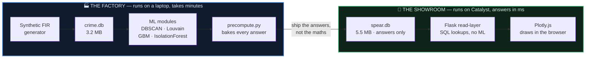
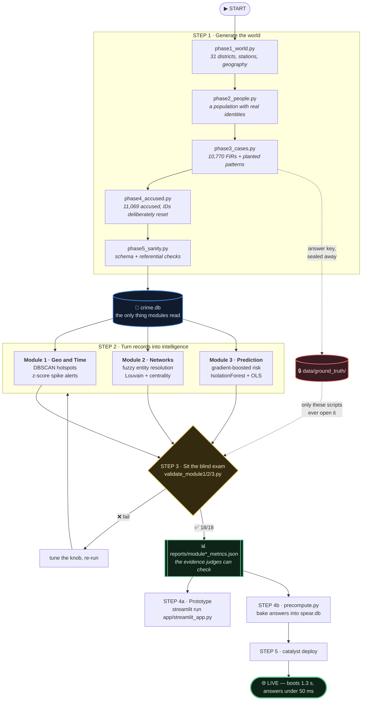
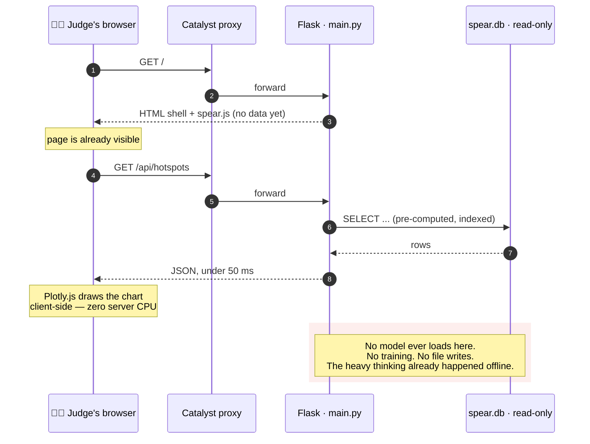

<div align="center">



# SPEAR

> **Turns 10,770 fragmented FIRs into four decisions: where to patrol, who to investigate, what to expect next, and what doesn't fit.**

**KSP Datathon 2026 · Challenge 2 · Team `themamba_bros`**

[](https://spear-intel-50043295151.development.catalystappsail.in)
[](#-the-scorecard--every-claim-has-a-receipt)
[](#-run-it-locally-in-3-commands)

### 🔗 **[spear-intel-50043295151.development.catalystappsail.in](https://spear-intel-50043295151.development.catalystappsail.in)**

*No login. No setup. Opens in about a second.*

</div>

---

## 📖 Read this in 60 seconds

A commissioner opening 10,770 FIRs sees a spreadsheet — one row per case, no memory of people, no map of pressure, no sense of what comes next. SPEAR reads the *same* records and returns **four decisions**.

| # | The question | What SPEAR answers with | Headline result |
|---|---|---|---|
| 1 | **WHERE** do I put patrols? | DBSCAN density clustering + per-capita normalisation | **4 patrol-sized hotspots** holding 19% of all cases |
| 2 | **WHEN** do I staff up? | Day × hour incident surface | Chain snatching is **77% weekend-evening** (uniform ≈ 11%) |
| 3 | **WHO** do I investigate? | Fuzzy entity resolution + Louvain communities | **11,069 accused records → 8,911 real people**, 4/4 rings found |
| 4 | **WHAT'S NEXT** month? | Gradient-boosted risk on district × type × month | Top-20 cells capture **47.5%** of next-window crime — **16.2× random** |
| 5 | **WHAT DOESN'T FIT**? | IsolationForest + z-score eruption detection | **108 cases** flagged; one cell ran **186σ** above its own baseline |

---

## 🏗️ The one idea that makes this work

Most dashboards try to *compute* while the judge waits. SPEAR splits itself in two so it never has to.

> ### **Compute offline. Serve stdlib. Render in the browser.**



**Why it matters:** Zoho Catalyst kills any app that takes >10 s to bind a port or >30 s to answer. SPEAR **boots in 1.3 s and answers in under 50 ms**, because by the time it's deployed there is no maths left to do — only lookups.

<details>
<summary><b>💡 The hard lesson behind this design (click to expand)</b></summary>

<br/>

The first attempt deployed Streamlit straight to Catalyst. It failed, and not for a fixable reason:

Streamlit drives its entire UI over a **WebSocket** at `/_stcore/stream`. Catalyst's proxy **does not upgrade WebSocket connections** — a raw handshake returns `HTTP 200`, never the `HTTP 101 Switching Protocols` the client needs. The block sits at the *proxy* layer, above both the managed and native runtimes, so no runtime switch escapes it.

That constraint is what produced the split architecture. Streamlit survives as the **local research console**; the deployed artefact is a stateless Flask read-layer that renders through Plotly.js over plain HTTP. The constraint made the design better: the public dashboard now has no way to be slow.

</details>

---

## 🔄 The full flow, start to end

Everything below runs **once, offline**. The deployed app never touches any of it.



### What happens on each request, once it's live



---

## 🔒 The sealed exam — why these numbers can be trusted

This is the part worth reading twice.

Every pattern SPEAR claims to find was **planted into the synthetic data on purpose**, then **sealed into `data/ground_truth/`**. The platform then had to rediscover them *blind*.

> ### ⚠️ Only `validate_module1.py`, `validate_module2.py`, `validate_module3.py` and `data/phase6_validate.py` ever read `data/ground_truth/`.
> ### The platform — `src/`, `app/`, and `deploy/` — **never opens that folder.** Not once, not to peek, not to tune.

Ground truth is committed here **on purpose**, so you can delete `reports/*.json`, re-run the validators yourself, and get the same scorecard. Verify the claim in one command:

```bash
grep -rn "ground_truth" src/ app/ deploy/ --include=*.py
```

That returns **nothing**. The answer key was never in the room.

---

## 📊 The scorecard — every claim has a receipt

**18 of 18 blind checks passed.** Each row is machine-generated into `reports/`, not typed by hand.

### Module 1 · Geography and time → [`module1_metrics.json`](./datathon/ksp-crime-intel/reports/module1_metrics.json)

| Check | Result | Verdict |
|---|---|:--:|
| DBSCAN recovers planted hotspots | **3 / 3**, each 100% inside a single cluster | ✅ |
| Hotspot precision (not drowning in noise) | 4 clusters total at default settings | ✅ |
| Alerts fire on planted spikes | **2 / 2** flagged | ✅ |
| Alert precision | only 4 alerts across 36 mo × 31 districts × 22 types | ✅ |
| Planted time bias visible | Chain snatching **76.6%** weekend-evening vs ~11% uniform | ✅ |

### Module 2 · Entity resolution and networks → [`module2_metrics.json`](./datathon/ksp-crime-intel/reports/module2_metrics.json)

| Check | Result | Verdict |
|---|---|:--:|
| Entity resolution vs sealed identities | **F1 0.910** (precision 0.859 · recall 0.969) | ✅ |
| Criminal rings recovered | **4 / 4**, coverage 100% | ✅ |
| Ring purity (no strangers swept in) | **1.00** average | ✅ |
| Kingpins by betweenness centrality | **10 / 10** top entities were real ring members | ✅ |
| Money shot | Entity 702 "Prakash Shetty" — **5 aliases across 18 cases** | ✅ |

### Module 3 · Prediction and anomaly → [`module3_metrics.json`](./datathon/ksp-crime-intel/reports/module3_metrics.json)

| Check | Result | Verdict |
|---|---|:--:|
| Top-20 risk cells hit-rate *(temporal holdout)* | **47.5%** of next-window crime | ✅ |
| Lift over random allocation | **16.2×** (random ≈ 2.93%) | ✅ |
| Beats naive persistence baseline | 47.5% vs 37.5% | ✅ |
| Risk band calibration | High **1.24×** expected · Low **0.20×** | ✅ |
| Planted hotspots land in the High band | **80%** | ✅ |
| Socio-economic driver *(OLS)* | literacy **β = −18.881, p = 0.0003, r = −0.524** | ✅ |
| Case-level anomaly recall @ 2% triage | **0.27** (73 of 270) — *reported honestly, see below* | ✅ |
| Cell-level eruption detection | Kalaburagi drug possession **186σ**, 141 cases vs ~1 expected | ✅ |

> **On that 0.27.** We report it as-is rather than tuning the triage budget until it flatters. The case-level anomaly layer is a **prioritiser for analyst attention**, not a complete census of every oddity — and at a realistic 2% budget, surfacing 73 genuine planted anomalies is the honest result. The cell-level detector, which is the one an SP would actually act on, recovered its planted eruption cleanly.

---

## 🚀 Run it locally in 3 commands

```bash
git clone https://github.com/vaibhavkumarsingh12/datathone.git && cd datathone/datathon/ksp-crime-intel
```

```bash
pip install -r requirements.txt
```

```bash
streamlit run app/streamlit_app.py
```

`crime.db` is committed (3.2 MB), so the dashboard has data the moment it opens — no generation step required.

<details>
<summary><b>Optional — rebuild everything from scratch and re-sit the exams</b></summary>

<br/>

```bash
python data/run_all.py
python src/module1_geo.py
python src/module2_er.py
python src/module2_network.py
python src/module3_risk.py
python src/module3_anomaly.py
```

Then re-sit all three blind exams — this overwrites `reports/*.json` with freshly computed evidence:

```bash
python validate_module1.py && python validate_module2.py && python validate_module3.py
```

Expected: `5/5`, `6/6`, `7/7`.

</details>

<details>
<summary><b>Optional — redeploy the public dashboard</b></summary>

<br/>

```bash
cd deploy
python precompute.py
python verify_build.py
cd spear-catalyst && catalyst deploy
```

`precompute.py` is the bridge between the two halves: it reads the research database and writes the tiny answers-only database the live app serves. `verify_build.py` must report 8/8 before deploying.

</details>

---

## 🗺️ Repo map

```
datathone/
├── README.md ...................... you are here
├── banner.svg
└── datathon/ksp-crime-intel/
    │
    ├── THE FACTORY — offline, heavy, never deployed
    │   ├── data/
    │   │   ├── phase1_world.py ... phase5_sanity.py .. synthetic FIR generator
    │   │   ├── run_all.py ............................ one-shot rebuild
    │   │   ├── ground_truth/ ......................... the answer key — validators only
    │   │   └── output/crime.db ....................... 3.2 MB · the research database
    │   │
    │   ├── src/
    │   │   ├── db.py ................................. shared loaders
    │   │   ├── module1_geo.py ........................ DBSCAN hotspots · spike alerts
    │   │   ├── module2_er.py ......................... fuzzy entity resolution
    │   │   ├── module2_network.py .................... co-offence graph · Louvain
    │   │   ├── module3_risk.py ....................... gradient-boosted risk
    │   │   └── module3_anomaly.py .................... IsolationForest · z-scores · OLS
    │   │
    │   ├── validate_module1.py ....................... blind exam · 5 checks
    │   ├── validate_module2.py ....................... blind exam · 6 checks
    │   ├── validate_module3.py ....................... blind exam · 7 checks
    │   └── reports/
    │       ├── module1_metrics.json .................. evidence
    │       ├── module2_metrics.json .................. evidence
    │       ├── module3_metrics.json .................. evidence
    │       └── intelligence_report.md ................ the 2-page written brief
    │
    ├── THE PROTOTYPE — local research console
    │   └── app/
    │       ├── streamlit_app.py ...................... entry point
    │       ├── network_tab.py ........................ Module 2 tab
    │       └── risk_anomaly_tab.py ................... Module 3 tabs
    │
    └── THE SHOWROOM — what actually gets deployed
        └── deploy/
            ├── precompute.py ......................... bakes answers into spear.db
            ├── verify_build.py ....................... 8 pre-flight checks
            └── spear-catalyst/
                ├── main.py ........................... Flask read-layer
                ├── queries.py ........................ SQL lookups only
                ├── app-config.json ................... stack: python_3_12
                ├── static/js/spear.js ................ Plotly.js rendering
                └── data/spear.db ..................... 5.5 MB · answers only
```

---

## 🧭 Where to look first

| If you have… | Open this |
|---|---|
| **30 seconds** | The [live dashboard](https://spear-intel-50043295151.development.catalystappsail.in) — Overview tab |
| **2 minutes** | [`reports/intelligence_report.md`](./datathon/ksp-crime-intel/reports/intelligence_report.md) — the written brief |
| **5 minutes** | The [scorecard](#-the-scorecard--every-claim-has-a-receipt) above, then `reports/*.json` to check it |
| **You want to break it** | Run the `grep` in [The sealed exam](#-the-sealed-exam--why-these-numbers-can-be-trusted) |

---

## 📐 Design notes

Charts follow **Storytelling with Data** discipline, which is why they read differently from a default dashboard:

- **Titles are findings, not labels.** Not *"Crime by type"* but *"Theft leads at 1,245 cases — 12% of all crime in this view"*. Titles are computed from the data currently on screen, so they stay true when you filter.
- **One accent per chart.** The single thing that matters is coloured; everything else is slate `#3A4C63`. Your eye is directed, not left to wander.
- **Validated numbers are quoted, never recomputed.** The dashboard reads `reports/*.json` directly — so the app, the deck and the report *cannot* disagree with each other.

---

<div align="center">

### One sentence

**SPEAR turns 10,770 fragmented FIRs into four decisions — where to patrol, who to investigate, what to expect, and what doesn't fit — computed offline against a sealed exam and served from a stateless read layer that boots in 1.3 s and answers in under 50 ms.**

<br/>

*Built for KSP Datathon 2026 · Challenge 2 · Team `themamba_bros`*

*All data is synthetic. No real case, person, or address appears anywhere in this repository.*

</div>
